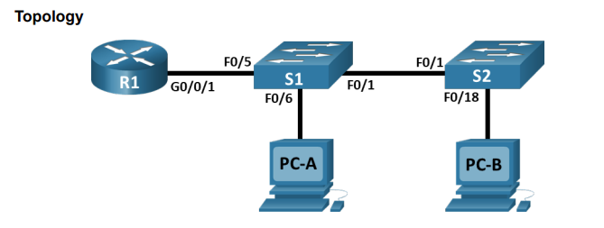
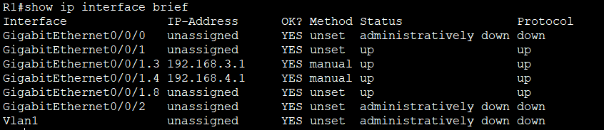

# Lab - Configure Router-on-a-Stick Inter-VLAN Routing



Таблица адроесации

|Устройства|Интерфейс|IP-адрес|Маска подсети| Шлюз по умолчанию 
|:--------------:|:------------:|:-----------|:-----------:|:------------:|
|R1|G0/0/1.3|192.168.3.1|255.255.255.0|N/A|
|  | G0/0/1.4|192.168.4.1|255.255.255.0|  |
|  |G0/0/1.8|N/A|N/A|  |
|S1|VLAN 3|192.168.3.11|255.255.255.0|192.168.3.1|
|S2|VLAN 3| 192.168.3.12|255.255.255.0|192.168.3.1|
|PC-A|NIC|192.168.3.3|255.255.255.0|192.168.3.1|
PC-B|NIC|192.168.4.3|255.255.255.0|192.168.4.1|

## 1.Build the Network and Configure Basic Device Settings :


R1
```
enable
conf t
hostname R1

no ip domain-lookup

enable secret class

line console 0
password cisco
login
exit

line vty 0 4
password cisco
login
exit

service password-encryption

banner motd "Alarm!"
end

clock set 15:50:00 13 April 2025

copy run start
```
### 3.Configure basic settings for each switch.

S1-S2

```
enable
conf t 
hostname S1

no ip domain-lookup

enable secret class

line console 0
password cisco
login
exit

line vty 0 4
password cisco
login
exit

service password-encryption

banner motd "Alarm!"
end

set clock 15:55:00 13 April 2025

copy run start
```

4.Configure PC hosts.
Refer to the Addressing Table for PC host address information. 

PC-A


PC-B


2.Create VLANs and Assign Switch Ports

S1-S2

```
enable
conf t

vlan 3 
name MANAGEMENT

vlan 4
name OPERATOINS

vlan 7
name PARKINGLOT

vlan 8 
name NATIVE
```


Configure the management interface and default gateway on each switch using the IP address
information in the Addressing Table.

S1
```
enable
conf t

interface vlan 3
ip address 192.168.3.11 255.255.255.0
exit

ip default-gateway 192.168.3.1
```

S2
```
enable
conf t

interface vlan 3
ip address 192.168.3.12 255.255.255.0
exit

ip default-gateway 192.168.3.1
```
Assign all unused ports on both switches to the ParkingLot VLAN, configure them for static access mode,
and administratively deactivate them. 

S1
```
enable
conf t

interface range fa 0/2-4, fa 0/7-24, g0/1-2

switchport mode access

switchport access vlan 7

shutdown
```

S2

```
enable
conf t

interface range fa 0/2-17, fa 0/19-24, g0/1-2

switchport mode access

switchport access vlan 7

shutdown
```

Assign used ports to the appropriate VLAN (specified in the VLAN table above) and configure them for
static access mode. Be sure to do this on both switches 


S1
```
enable
conf t

interface fa0/6
switchport mode access
switchport access vlan 3
```

S2
```
enable
conf t

interface fa 0/18
switchport mode access
switchport access vlan 3

```
S1:


S2:


#### Configure an 802.1Q Trunk Between the Switches

Change the switchport mode on interface F0/1 to force trunking. Make sure to do this on both switches.

S1-S2
```
enable
conf t

interface fa0/1
switchport mode trunk

```

As a part of the trunk configuration, set the native VLAN to 8 on both switches. You may see error
messages temporarily while the two interfaces are configured for different native VLANs.

S1-S2
```
switchport trunk native vlan 8
```
As another part of trunk configuration, specify that VLANs 3, 4, and 8 are only allowed to cross the trunk. 

S1-S2

```
switchport trunk allowed vlan remove 1
switchport trunk allowed vlan remove 7
```


a. Configure the F0/5 on S1 with the same trunk parameters as F0/1. This is the trunk to the router. 

```
enable
conf t

interface fa0/5

switchport mode trunk

copy run start
```

4.Configure Inter-VLAN Routing on the Router

a. Activate interface G0/0/1 on the router. 

R1

```
enable
conf t

interface g0/0/1
no shutdown
```


Configure sub-interfaces for each VLAN as specified in the IP addressing table. All sub-interfaces use
802.1Q encapsulation. Ensure the sub-interface for the native VLAN does not have an IP address
assigned. Include a description for each sub-interface. 
R1

```
enable
conf t

interface g0/0/1.3
description MANAGEMENT

encapsulation dot1Q 3

ip address 192.168.3.1 255.255.255.0
exit

interface g0/0/1.4

description OPERATIONS

encapsulation dot1Q 4

ip address 192.168.4.1 255.255.255.0
exit

interface g0/0/1.8

description NATIVE_VLAN

encapsulation dot1Q 8 native

```



#### Verify Inter-VLAN Routing is Working 

a. Ping from PC-A to its default gateway.<br/>
b. Ping from PC-A to PC-B<br/>
c. Ping from PC-A to S2 


From the command prompt on PC-B, issue the tracert command to the address of PC-A. 


