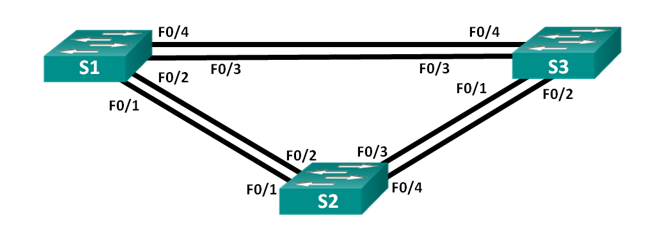
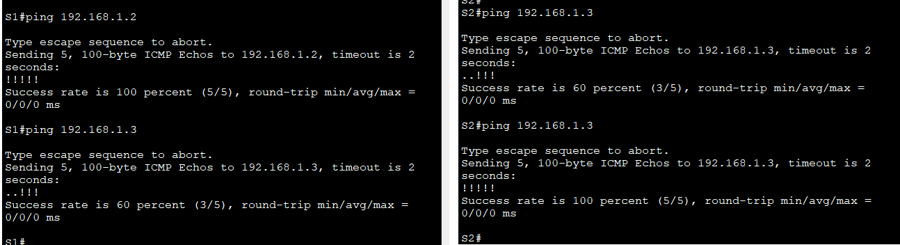
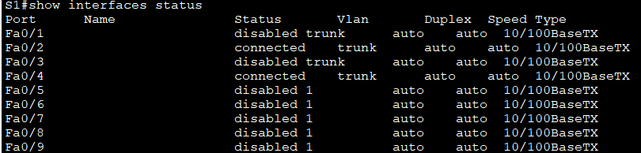
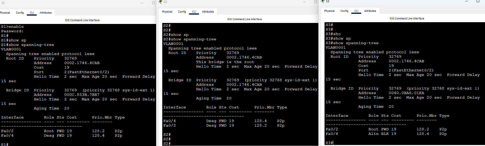
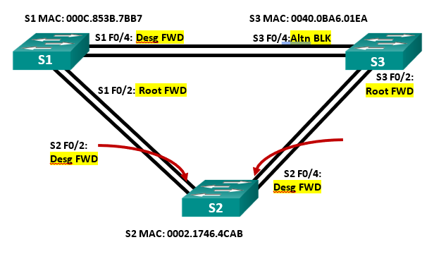
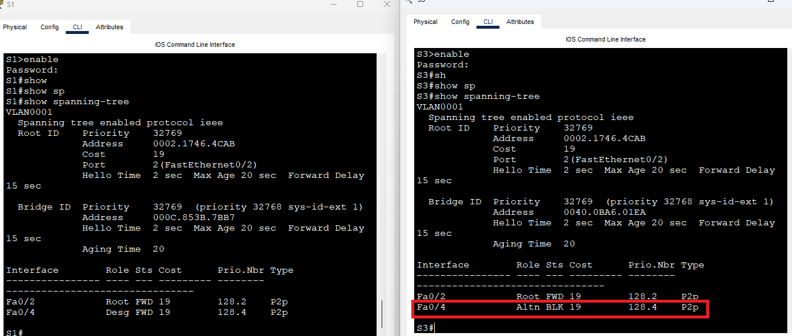
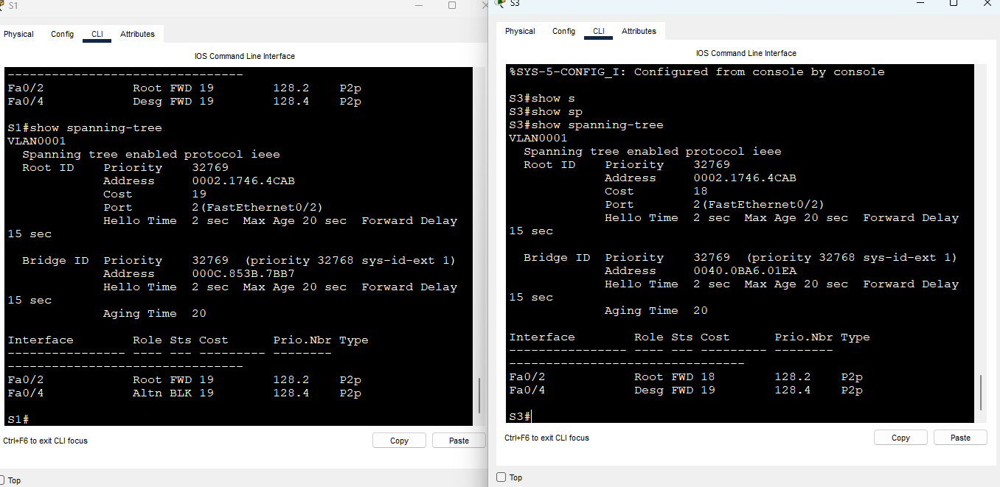
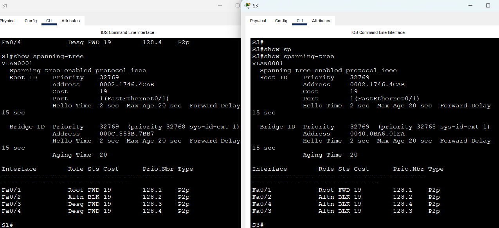

 # Лабораторная работа. Развертывание коммутируемой сети с резервными каналами

 #### Топология :

 

Таблица адресации :

|Устройство|Интерфейс|Ip-адрес|Маска подсети|
|:------:|:-------:|:-------:|:--------:|
S1|Vlan1|192.168.1.1|255.255.255.0|
S2|Vlan1|192.168.1.2|255.255.255.0|
S3|Vlan3|192.168.1.3|255.255.255.0|

Настройте базовые параметры каждого коммутатора:

Отключить поиск DNS
```
no ip domain-lookup
```

```
enable
conf t
hostname
enable secret class

line console 0
password cisco
login
logging syncronous
exit

line vty 0 4
password cisco
login
exit

banner motd "Alarma!"
exit

copy run start
```
Назначьте IP-адрес для VLAN 1 на каждом коммутаторе:

```
interface vlan 1

ip address 192.168.1.1 255.255.255.0    # S1

ip address 192.168.1.2 255.255.255.0    # S2

ip address 192.168.1.3 255.255.255.0    # S3

no shutdown
exit
copy run start
```
Проверьте связь:




## Часть 2:	Определение корневого моста

 1 	Отключите все порты на коммутаторах.<br/>
 ```
 conf t
 interface range f0/1-24
 shutdown
 exit
 interface g0/1-2
 shutdown
 exit
 ```
 2	Настройте подключенные порты в качестве транковых.<br/>
 ```
 conf t
 interface range f0/1-4
 switchport mode trunk
 exit

```
3	Включите порты F0/2 и F0/4 на всех коммутаторах.<br/>
```
conf t
interface f0/2
no shutdown
exit
interface f0/4
no shutdown
exit
```

 4	Отобразите данные протокола spanning-tree.<br/>

 
 
* запишите роль и состояние (Sts) активных портов на каждом коммутаторе в топологии



* **Какой коммутатор является корневым мостом?**


Корневым мостом является коммутатор S2.

* **Почему этот коммутатор был выбран протоколом spanning-tree в качестве корневого моста?**

Если приоритет (по умолчанию 32768) у всех одинаковый , то корневым мостом становится с наименьшим MAC-адресом.
Сравнение MAC-адресов происходит побайтово, у кого следующий байт меньше считается "меньшим" MAC-адресом и коммутатор становится корневым мостом 

- S1 000C.853B.7BB7 
- S2 0002.1746.4CAB
- S3 0040.0BA6.01EA

Сравнение первых байт S1 - 00 ; S2- 00 ; S3 - 00<br/>
Сравнение вторых байт S1 - 0С ; **S2- 02** ; S3 - 40

Mac-адрес 0002.1746.4CAB  у S2 имеет наименьшее значение во втором байте (02), коммутатор S2 становится корневым мостом.

* **Какие порты на коммутаторе являются корневыми портами?**

Fa0/2 на коммутаторе S1<br/>
Fa0/2 на коммутаторе S3

* **Какие порты на коммутаторе являются назначенными портами?**

Fa0/2 и Fa0/4 на коммутаторе S2<br/> 
Fa0/2 и Fa0/4 на коммутаторе S1<br/>
Fa0/2 на коммутаторе S3

* **Какой порт отображается в качестве альтернативного и в настоящее время заблокирован?**

Fa0/4 на коммутаторе S3

* **Почему протокол spanning-tree выбрал этот порт в качестве невыделенного (заблокированного) порта?**

У S1 MAC-адрес выше, чем у S3, поэтому его порт Fa0/4 на S1 становится альтернативным (заблокированным), а порт Fa0/4 на S3 остается назначенным (Designated).Чтобы предотвратить создание петель в сети.

## Часть 3:	Наблюдение за процессом выбора протоколом STP порта, исходя из стоимости портов

- **Определите коммутатор с заблокированным портом.**

Коммутатор S3 порт f0/4



-	**Измените стоимость порта.**

```
conf t
interface f0/2
spanning-tree vlan 1 cost 18
```

- **Просмотрите изменения протокола spanning-tree.**



- **Почему протокол spanning-tree заменяет ранее заблокированный порт на назначенный порт и блокирует порт, который был назначенным портом на другом коммутаторе?**

При снижение до 18 cost на порту f0/2 коммутатора S3 этот маршрут становится
приоритетным и блокирует порт f0/4 на S1, STP выбирает лучший маршрут на основе новых параметров.

- **Удалите изменения стоимости порта.**

```
conf t
interface f0/2
no spanning-tree vlan 1 cost 18
```


## Часть 4:	Наблюдение за процессом выбора протоколом STP порта, исходя из приоритета портов


- **Включите порты F0/1 и F0/3 на всех коммутаторах. После чего выполните команду show spanning-tree на коммутаторах некорневого моста**



- **Какой порт выбран протоколом STP в качестве порта корневого моста на каждом коммутаторе некорневого моста?**

На коммутаторе S1 и S3 корневой порт f0/1

- **Почему протокол STP выбрал эти порты в качестве портов корневого моста на этих коммутаторах?**

Потому что у этих портов cost 19 и STP делает их оптимальным маршрутом

- **Какое значение протокол STP использует первым после выбора корневого моста, чтобы определить выбор порта?**

Порт с наименьшим cost выбирается как корневой порт

- **2.	Если первое значение на двух портах одинаково, какое следующее значение будет использовать протокол STP при выборе порта?**

Следующее значение Bridge ID. значение от 0 до 65535 , по умолчанию 32768.

- **3.	Если оба значения на двух портах равны, каким будет следующее значение, которое использует протокол STP при выборе порта?**

Следующее значение будет Prio.Nbr выбирается порт с наименьшим значением