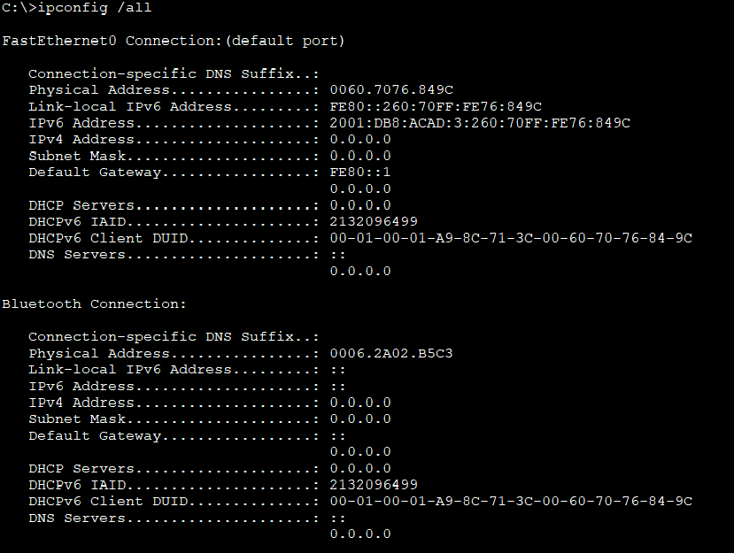

# Лабораторная работа - Реализация DHCPv4

#### Топология:


Таблица адресации:

|Устройство|Интерфейс|Ip-адрес|Маска подсети|Шлюз по умолчанию|
|:---------:|:----------:|:---------:|:------------:|:------------:|
|R1|G0/0/0<br/>G0/0/1<br/>G0/0/1.100<br/>G0/0/1.200<br/>G0/0/1.1000|10.0.0.1<br/>----- <br/> 192.168.1.1<br/>192.168.1.65 <br/>-----<br/>|255.255.255.252<br/>----- <br/>255.255.255.192 <br/>255.255.255.224 <br/>-----<br/>|-----<br/><br/> <br/> <br/><br/>|
|R2|G0/0<br/>G0/0/1|10.0.0.2<br/>192.168.1.97 <br/>|255.255.255.252<br/>255.255.255.240<br/>|-----<br/> <br/>|
|S1|VLAN 200|192.168.1.66 |255.255.255.224 | 192.168.1.65|
|S2|VLAN 1|192.168.1.98 | 255.255.255.240|192.168.1.97 |
|PC-A|NIC|DHCP|DHCP|DHCP|
|PC-B|NIC|DHCP|DHCP|DHCP|

Таблица VLAN

|VLAN|Имя|Назначенный интерфейс|
|:-------:|:---------:|:----------:|
|1|Нет|S2: F0/18|
|100|Клиенты(client) |S1:F0/6|
|200|Управление(mng)|S1: VLAN 200|
|999|Parking Lot|S1: F0/1-4, F0/7-24, G0/1-2|
|1000|Собственная(native)|-----|

## Часть 1.	Создание сети и настройка основных параметров устройства

Шаг 1.	Создание схемы адресации

Подсеть сети 192.168.1.0/24 в соответствии со следующими требованиями:
-a.	Одна подсеть «Подсеть A», поддерживающая 58 хостов (клиентская VLAN на R1).
 
 - Подсеть А: 192.168.1.0/26 <br/> 
  192.168.1.1 - первый ip адрес для R1 G0/0/1.100<br/>

  -b.	Одна подсеть «Подсеть B», поддерживающая 28 хостов (управляющая VLAN на R1). 
Подсеть B:
Запишите первый IP-адрес в таблице адресации для R1 G0/0/1.200. Запишите второй IP-адрес в таблице адресов для S1 VLAN 200 и введите соответствующий шлюз по умолчанию.

- Подсеть B: 192.168.1.64/27<br/>
 192.168.1.65 - первый адрес подсети для R1 G0/0/1.200<br/>
 192.168.1.66 - втрой адрес подсети для S1 VLAN 200

 -c.	Одна подсеть «Подсеть C», поддерживающая 12 узлов (клиентская сеть на R2).
Подсеть C:
Запишите первый IP-адрес в таблице адресации для R2 G0/0/1.

- Подсеть С: 192.168.1.96/28<br/>
192.168.1.97 - первый адрес подсети для R2 G0/0/1

Шаг 3.	Произведите базовую настройку маршрутизаторов.
Настройка R1 и R2
```
enable
conf t
hostname R1
no ip domain-lookup

enable secret class

line console 0
password cisco
login
exit

line vty 0 4
password cisco
login
exit

service password-encryption

set clock 09:00:00 29 Nov 2024

copy run start

```

Шаг 4.	Настройка маршрутизации между сетями VLAN на маршрутизаторе R1

```
interface g0/0/1.100
encapsulation dot1Q 100
ip address 192.168.1.1 255.255.255.192
description Client Vlan
no shutdown

interface g0/0/1.200
encapsulation dot1Q 200
ip address 192.168.1.65 255.255.255.224
description MNG Vlan
no shutdown

interface g0/0/1.1000
encapsulation dot1Q 1000 native
description Native Vlan
no ip address
no shutdown

```

Шаг 5.	Настройте G0/1 на R2, затем G0/0/0 и статическую маршрутизацию для обоих маршрутизаторов
a. Настройте G0/0/1 на R2 с первым IP-адресом подсети C
```
interface g0/0/1
ip address 192.168.1.97 255.255.255.240
no shutdown
```
b.	Настройте интерфейс G0/0/0 для каждого маршрутизатора на основе приведенной выше таблицы IP-адресации.
R1:
```
conf t
interface g0/0/0
ip address 10.0.0.1 255.255.255.252
no shutdown
```
R2:
```
conf t
interface g0/0/0
ip address 10.0.0.2 255.255.255.252
no shutdown
```
 
c.	Настройте маршрут по умолчанию на каждом маршрутизаторе, указываемом на IP-адрес G0/0/0 на другом маршрутизаторе.
R1:
```
conf t
ip route 0.0.0.0  0.0.0.0   10.0.0.2
```
R2:
```
conf t
ip route 0.0.0.0   0.0.0.0  10.0.0.1
```    
d.	Убедитесь, что статическая маршрутизация работает с помощью пинга до адреса G0/0/1 R2 от R1.


Шаг 7.	Создайте сети VLAN на коммутаторе S1.
a.	Создайте необходимые VLAN на коммутаторе 1 и присвойте им имена из приведенной выше таблицы.
```
vlan 100
name Client
exit
vlan 200
name MNG
exit
vlan 999
name Parking_Lot
exit
vlan 1000
name Native
exit

```
b. Настройте и активируйте интерфейс управления на S1 (VLAN 200), используя второй IP-адрес из подсети, рассчитанный ранее. Кроме того установите шлюз по умолчанию на S1.
```
conf t
interface vlan 200
ip address 192.168.1.66 255.255.255.224
no shutdown
exit

ip default-gateway 192.168.1.65
exit
copy run start
```
c.	Настройте и активируйте интерфейс управления на S2 (VLAN 1), используя второй IP-адрес из подсети, рассчитанный ранее. Кроме того, установите шлюз по умолчанию на S2

```
conf t
interface vlan 1 
ip address 192.168.1.98 255.255.255.240
no shutdown
exit
ip default-gateway 192.168.1.97
```
d.	Назначьте все неиспользуемые порты S1 VLAN Parking_Lot, настройте их для статического режима доступа и административно деактивируйте их. На S2 административно деактивируйте все неиспользуемые порты

- S1
```
conf t
interface range f0/1-4, f0/7-24, g0/1-2
switchport mode access
switchportaccess vlan 999
shutdown
exit
```
- S2
```
conf t
interface range f0/1-4, f0/6-17, f0/19-24, g0/1-2
switchport mode access
shutdown
exit
```
Шаг 8.	Назначьте сети VLAN соответствующим интерфейсам коммутатора.

a.	Назначьте используемые порты соответствующей VLAN (указанной в таблице VLAN выше) и настройте их для режима статического доступа.
- S1
```
conf t
interface f0/6
switchport mode access
switchport access vlan 100
```

     Почему интерфейс F0/5 указан в VLAN 1?

     -Порт f0/5 не настроен в качестве транк, по умолчанию находится в VLAN 1
 Шаг 9.	Вручную настройте интерфейс S1 F0/5 в качестве транка 802.1Q.

 ```
 conf t
 interface f0/5
 switchport mode trunk
 ```
 b.	В рамках конфигурации транка  установите для native  VLAN значение 1000 .	В качестве другой части конфигурации магистрали укажите, что VLAN 100, 200 и 1000 могут проходить по транку. 
 ```
 switchport trunk native vlan 1000
 switchport trunk allowed vlan 100,200,1000
 ```   


### Часть 2.	Настройка и проверка двух серверов DHCPv4 на R1
Шаг 1.	Настройте R1 с пулами DHCPv4 для двух поддерживаемых подсетей. Ниже приведен только пул DHCP для подсети A

-Исключите первые пять используемых адресов из каждого пула адресов.
R1:
```
conf t
ip dhcp excluded-address 192.168.1.1 192.168.1.5
```
- b.	Создайте пул DHCP
```
ip dhcp pool R1-Client-Lan
``` 
 - c.	Укажите сеть, поддерживающую этот DHCP-сервер
```
network 192.168.1.0 255.255.255.192
```
- d.	В качестве имени домена укажите CCNA-lab.com.
```
domain-name CCNA-lab.com
```
- e.	Настройте соответствующий шлюз по умолчанию для каждого пула DHCP.
```
default-router 192.168.1.1
```


- g.	Затем настройте второй пул DHCPv4, используя имя пула R2_Client_LAN и вычислите сеть, маршрутизатор по умолчанию, и используйте то же имя домена и время аренды, что и предыдущий пул DHCP.


```
conf t
ip dhcp excluded-address 192.168.1.97 192.168.1.101
ip dhcp pool R2-Client-Lan
network 192.168.1.96 255.255.255.240
default-router 192.168.1.97
domain-name CCNA-lab.com
```

Шаг 3.	Проверка конфигурации сервера DHCPv4
a.	Чтобы просмотреть сведения о пуле, выполните команду show ip dhcp pool .

b.	Выполните команду show ip dhcp bindings для проверки установленных назначений адресов DHCP.


Шаг 1.	Настройка R2 в качестве агента DHCP-ретрансляции для локальной сети на G0/0/1

a.	Настройте команду ip helper-address на G0/0/1, указав IP-адрес G0/0/0 R1.

```
ip helper-address 10.0.0.1
```


- получить IP-адрес от DHCP на PC-A и PC-B:


# Лабораторная работа - Настройка DHCPv6

#### Топология :


#### Таблица адресации :

|Устройство|Интерфейс|Ipv6-адрес|
|:-------:|:----------:|:-----------:|
|R1| G0/0/0|2001:db8:acad:2::1/64<br/>fe80::1|
|R1| G0/0/1|2001:db8:acad:1::1/64<br/>fe80::1|
|R2| G0/0/0|2001:db8:acad:2::2/64<br/>fe80::2|
|R2| G0/0/1|2001:db8:acad:3::1/64<br/>fe80::1|
|PC-A|NIC|DHCP|
|PC-B|NIC|DHCP|

 __Задачи__:<br/>
- Часть 1. Создание сети и настройка основных параметров устройства<br/>
- Часть 2. Проверка назначения адреса SLAAC от R1<br/>
- Часть 3. Настройка и проверка сервера DHCPv6 без гражданства на R1<br/>
- Часть 4. Настройка и проверка состояния DHCPv6 сервера на R1<br/>
- Часть 5. Настройка и проверка DHCPv6 Relay на R2<br/>

##### Часть 1:

4. Настройка интерфейсов и маршрутизации для обоих маршрутизаторов:

- a) Настройте интерфейсы G0/0/0 и G0/1 на R1 и R2 с адресами IPv6, указанными в таблице выше.
 
- **Настройка R1 :** 
```
interface g0/0/0
ipv6 address 2001:db8:acad:2::1/64
ipv6 address fe80::1 link-local
no shutdown
exit

interface g0/0/1 
ipv6 address 2001:db8:acad:1::1/64
ipv6 address fe80::1 link-local
no shutdown
exit

```
- b) Настройте маршрут по умолчанию на каждом маршрутизаторе, который указывает на IP-адрес G0/0/0 на другом маршрутизаторе

```
ipv6 route ::/0 2001:db8:acad:2::2
copy run start
```


- **Настройка R2 :**
```
interface g0/0/0
ipv6 address 2001:db8:acad:2::2/64
ipv6 address fe80::2 link-local
no shutdown
exit

interface g0/0/1
ipv6 address 2001:db8:acad:3/64
ipv6 address fe80::1 link-local
no shutdown
exit

ipv6 route ::/0 2001:db8:acad2::1
copy run start
```


#### c)	Убедитесь, что маршрутизация работает с помощью пинга адреса G0/0/1 R2 из R1:


### Часть 2. Проверка назначения адреса SLAAC от R1


- Откуда взялась часть адреса с идентификатором хоста?

Идентификатор хоста 2E0:B0FF:FE93:C574 получился из мас-адреса 00E0.B093.C574

-мас-адрес 00E0.B093.C574 делиться на две части по 24 бита и между этими частями добавляется
 FFFE 

- 00E0BO**FFFE**93C574

-Седьмой бит адреса меняется на противоположный (1-на 0, 0- на еденицу)

- первый байт 00=000000**0**0- меняем 7 бит на **1** получится 00000010=02 **2E0:B0FF:FE93:C574**

### Часть 3. Настройка и проверка сервера DHCPv6 на R1

```
ipv6 dhcp pool R1-STATELESS
dns-server 2001:db8:acad::254
domain-name STATELESS.com
exit

interface g0/0/1
ipv6 nd other-config-flag
ipv6 dhcp server R1-STATELESS 
```


- f)	Тестирование подключения с помощью пинга IP-адреса интерфейса G0/1 R2


### Часть 4. Настройка сервера DHCPv6 с сохранением состояния на R1:

 - a.	Создайте пул DHCPv6 на R1 для сети 2001:db8:acad:3:aaa::/80. Это предоставит адреса локальной сети, подключенной к интерфейсу G0/0/1 на R2. В составе пула задайте DNS-сервер 2001:db8:acad: :254 и задайте доменное имя STATEFUL.com.

```
ipv6 dhcp pool R2-STATEFUL
address prefix 2001:db8:acad:3:aaa::/80
dns-server 2001:db8:acad::254
domain-name STATEFUL.com
exit

interface g0/0/0
ipv6 dhcp server R2-STATEFUL
```

### Часть 5. Настройка и проверка ретрансляции DHCPv6 на R2.
 настроить и проверить ретрансляцию DHCPv6 на R2, позволяя PC-B получать адрес IPv6.

 1. Включите PC-B и проверьте адрес SLAAC, который он генерирует.

 

 2. Настройте R2 в качестве агента DHCP-ретрансляции для локальной сети на G0/0/1.

 ```
 interface g0/0/1
 ipv6 nd managed-config-flag
 ipv6 dhcp relay destination 2001:db8:acad:2::1 g0/0/0
 exit
 copy run start
 ```
 