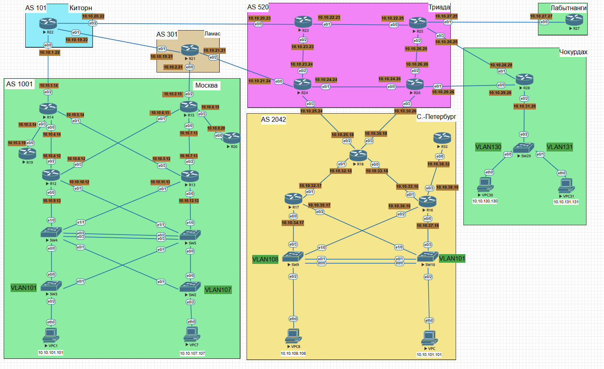

# Проектирование сети

Задание:

- Разработаете и задокументируете адресное пространство для лабораторного стенда. 
- Настроите ip адреса на каждом активном порту 
- Настроите каждый VPC в каждом офисе в своем VLAN. 
- Настроите VLAN/Loopbackup interface управления для сетевых устройств 

## Таблица адресного пространства

|Подсеть|Устройство 1|Интерфейс|Ip-адрес|Устройство 2|Интерфейс| Ip-адрес
|:---------:|:----------:|:---------:|:------------:|:------------:|:----------:|:-----------:|
| 10.10.1.0/24   | R14          | e0/2        | 10.10.1.14   | R22                | e0/0        | 10.10.1.22   |
| 10.10.2.0/24   | R15          | e0/2        | 10.10.2.15   | R21                | e0/0        | 10.10.2.21   |
| 10.10.3.0/24   | R14          | e0/3        | 10.10.3.14   | R19                | e0/0        | 10.10.3.19   |
| 10.10.4.0/24   | R14          | e0/0        | 10.10.4.14   | R12                | e0/2        | 10.10.4.12   |
| 10.10.5.0/24   | R14          | e0/1        | 10.10.5.14   | R13                | e0/3        | 10.10.5.13   |
| 10.10.6.0/24   | R15          | e0/1        | 10.10.6.15   | R12                | e0/3        | 10.10.6.12   |
| 10.10.7.0/24   | R15          | e0/0        | 10.10.7.15   | R13                | e0/2        | 10.10.7.13   |
| 10.10.8.0/24   | R15          | e0/3        | 10.10.8.15   | R20                | e0/0        | 10.10.8.20   |
| 10.10.9.0/24   | R12          | e0/0        | 10.10.9.12   | SW4                | e0/1        | —            |
| 10.10.10.0/24  | R12          | e0/1        | 10.10.10.12  | SW5                | e1/1        | —            |
| 10.10.11.0/24  | R13          | e0/1        | 10.10.11.13  | SW4                | e1/1        | —            |
| 10.10.12.0/24  | R13          | e0/0        | 10.10.12.13  | SW5                | e1/0        | —            |
| 10.10.19.0/24  | R22          | e0/1        | 10.10.19.22  | R21                | e0/1        | 10.10.19.21  |
| 10.10.20.0/24  | R22          | e0/2        | 10.10.20.22  | R23                | e0/0        | 10.10.20.23  |
| 10.10.21.0/24  | R21          | e0/2        | 10.10.21.21  | R24                | e0/0        | 10.10.21.24  |
| 10.10.22.0/24  | R23          | e0/1        | 10.10.22.23  | R25                | e0/0        | 10.10.22.25  |
| 10.10.23.0/24  | R23          | e0/2        | 10.10.23.23  | R24                | e0/2        | 10.10.23.24  |
| 10.10.24.0/24  | R24          | e0/1        | 10.10.24.24  | R26                | e0/0        | 10.10.24.26  |
| 10.10.25.0/24  | R24          | e0/3        | 10.10.25.24  | R18                | e0/2        | 10.10.25.18  |
| 10.10.26.0/24  | R25          | e0/2        | 10.10.26.25  | R26                | e0/2        | 10.10.26.26  |
| 10.10.27.0/24  | R25          | e0/1        | 10.10.27.25  | R27                | e0/0        | 10.10.27.27  |
| 10.10.28.0/24  | R25          | e0/3        | 10.10.28.25  | R28                | e0/1        | 10.10.28.28  |
| 10.10.29.0/24  | R26          | e0/1        | 10.10.29.26  | R28                | e0/0        | 10.10.29.28  |
| 10.10.30.0/24  | R26          | e0/3        | 10.10.30.26  | R18                | e0/3        | 10.10.30.18  |
| 10.10.31.0/24  | R28          | e0/2        | 10.10.31.28  | SW29               | e0/2        | —            |
| 10.10.32.0/24  | R18          | e0/1        | 10.10.32.18  | R17                | e0/1        | 10.10.32.17  |
| 10.10.33.0/24  | R18          | e0/0        | 10.10.33.18  | R16                | e0/1        | 10.10.33.16  |
| 10.10.34.0/24  | R17          | e0/0        | 10.10.34.17  | SW9                | e0/3        | —            |
| 10.10.35.0/24  | R17          | e0/2        | 10.10.35.17  | SW10               | e0/1        | —            |
| 10.10.36.0/24  | R16          | e0/2        | 10.10.36.16  | SW9                | e0/1        | —            |
| 10.10.37.0/24  | R16          | e0/0        | 10.10.37.16  | SW10               | e0/3        | —            |
| 10.10.38.0/24  | R16          | e0/3        | 10.10.38.16  | R32                | e0/0        | 10.10.38.32  |
|10.10.39.0/24|R14|e1/0|10.10.39.14|R15|e1/0|10.10.39.15|

### Настроите каждый VPC в каждом офисе в своем VLAN.

|VLAN ID |	VPC    |	Локация|	  Подсеть        |	Шлюз        |
|:------:|:-------:|:---------:|:----------:|:---------:|     
|101     |	VPC1   |	Москва / SW3|	10.10.101.0/24|	10.10.101.1  |
|107	 |VPC7	   |Москва / SW2	|10.10.107.0/24	 |  10.10.107.1  |
|108	 |VPC8	   |СПб / SW9	    | 10.10.108.0/24 |  10.10.108.1  |
|100	 |VPC	   |СПб / SW10	    |10.10.100.0/24	 |  10.10.100.1  |
|130	 |VPC30	   |Чокурдах / SW29	|10.10.130.0/24	 |  10.10.130.1  |
|131	 |VPC31	   |Чокурдах / SW29	|10.10.131.0/24	 |  10.10.131.1  |

### Настроите VLAN/Loopbackup interface управления для сетевых устройств

Адреса Loopback0 IPv4 будут в последнем октете иметь цифру, совпадающую с номером маршрутизатора на схеме, например, для маршрутизатора R22 адрес будет иметь вид 10.10.232.22/32

