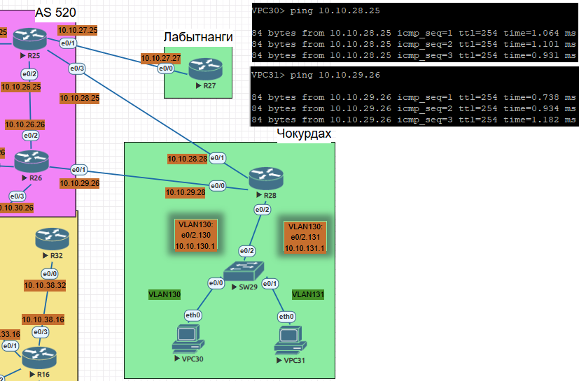
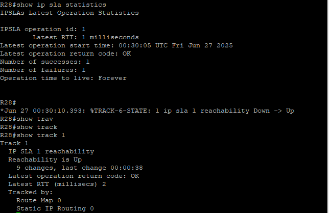

# Лабораторная работа - PBR 

Цель: <br/>


Офис Чокурдах подключен к AS 520 через два линка:

R28 - R25 (10.10.29.28 - 10.10.29.25)

R28 - R26 (10.10.30.28 - 10.10.30.26)

1. Настроить распределение трафика между этими линками.

2. Настроить IP SLA для отслеживания доступности линков.

3. Настроить маршрут по умолчанию для офиса Лабытнанги через R25

## 1 . Настройка PBR на R28 Чокурдах

Создаем ACL: 
```
conf t

ip access-list extended VPC30_TRAFFIC
 permit ip 10.10.130.0 0.0.0.255 any
 exit

ip access-list extended VPC31_TRAFFIC
 permit ip 10.10.131.0 0.0.0.255 any
 exit
```
Создаем политики:
```
route-map PBR_VPC30 permit 10
 match ip address VPC30_TRAFFIC
 set ip next-hop 10.10.28.25

route-map PBR_VPC31 permit 10
 match ip address VPC31_TRAFFIC
 set ip next-hop 10.10.28.26
```
траффик VPC30 идёт через R25
траффик VPC31 идёт через R26

применение политик на интерфейсы R28:
```
interface e0/2.130
 encapsulation dot1Q 130
 ip address 10.10.130.1 255.255.255.0
 ip policy route-map PBR_VPC30

 interface e0/2.131
 encapsulation dot1Q 131
 ip address 10.10.131.1 255.255.255.0
 ip policy route-map PBR_VPC31
```


### 2. Настроить IP SLA и отслеживания на R28.

- Если путь через 10.10.28.25 (интерфейс E0/1 к R25 ) работает, то использовать его

 - Если путь через 10.10.28.25 перестал работать, то использовать 10.10.29.26 (интерфейс E0/0 к R26 ) 

 ```
conf t

ip sla 1
icmp-echo 10.10.28.25 source-interface Ethernet0/1
 frequency 5
timeout 5000
exit

ip sla schedule 1 life forever start-time now

ip route 0.0.0.0 0.0.0.0 10.10.28.25 track 1
ip route 0.0.0.0 0.0.0.0 10.10.29.26 254
```
Маршрут через R25 10.10.28.25 будет основным , как только ping не проходит, то переключается на резеврный R26 10.10.29.26



конфиг R28 
```
R28#show running-config
Building configuration...

Current configuration : 1988 bytes
!
! Last configuration change at 00:29:57 UTC Fri Jun 27 2025
!
version 15.4
service timestamps debug datetime msec
service timestamps log datetime msec
no service password-encryption
!
hostname R28
!
boot-start-marker
boot-end-marker
!
!
!
no aaa new-model
mmi polling-interval 60
no mmi auto-configure
no mmi pvc
mmi snmp-timeout 180
!
!

no ip domain lookup
ip cef
no ipv6 cef
!
multilink bundle-name authenticated
!

redundancy
!
!
track 1 ip sla 1 reachability
!

interface Ethernet0/0
 ip address 10.10.29.28 255.255.255.0
!
interface Ethernet0/1
 ip address 10.10.28.28 255.255.255.0
!
interface Ethernet0/2
 no ip address
!
interface Ethernet0/2.130
 encapsulation dot1Q 130
 ip address 10.10.130.1 255.255.255.0
 ip policy route-map PBR_VPC30
!
interface Ethernet0/2.131
 encapsulation dot1Q 131
 ip address 10.10.131.1 255.255.255.0
 ip policy route-map PBR_VPC31

ip forward-protocol nd
!
!
no ip http server
no ip http secure-server
ip route 0.0.0.0 0.0.0.0 10.10.28.25 track 1
ip route 0.0.0.0 0.0.0.0 10.10.29.26 254
!
ip access-list extended VPC30_TRAFFIC
 permit ip 10.10.130.0 0.0.0.255 any
ip access-list extended VPC31_TRAFFIC
 permit ip 10.10.131.0 0.0.0.255 any
!
ip sla 1
 icmp-echo 10.10.28.25 source-interface Ethernet0/1
 frequency 5
ip sla schedule 1 life forever start-time now
!
route-map PBR_VPC31 permit 10
 match ip address VPC31_TRAFFIC
 set ip next-hop 10.10.29.26
!
route-map PBR_VPC30 permit 10
 match ip address VPC30_TRAFFIC
 set ip next-hop verify-availability 10.10.28.25 1 track 1
 set ip next-hop 10.10.29.26
!
!
!
control-plane
!
!
!
!
!
!
!
!
line con 0
 logging synchronous
line aux 0
line vty 0 4
 login
 transport input none
!
!
end


```
#### 3. Настроить маршрут по умолчанию для офиса Лабытнанги через R25

```
conf t

ip route 0.0.0.0 0.0.0.0 10.10.27.25
```


