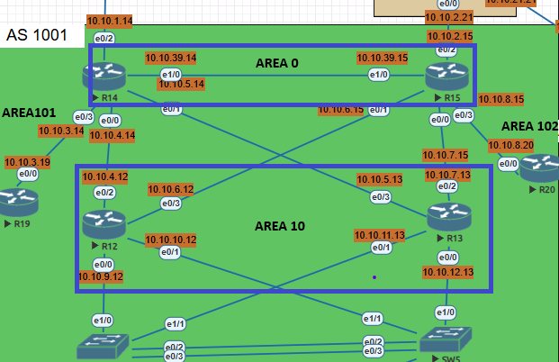

# Лабораторная работа 06 - OSPF



Цель:

Настроить OSPF офисе Москва<br/>
Разделить сеть на зоны<br/>
Настроить фильтрацию между зонами<br/>

Описание/Пошаговая инструкция выполнения домашнего задания:

1. Маршрутизаторы R14-R15 находятся в зоне 0 - backbone.<br/>
2. Маршрутизаторы R12-R13 находятся в зоне 10. Дополнительно к маршрутам должны получать маршрут по умолчанию.<br/>
3. Маршрутизатор R19 находится в зоне 101 и получает только маршрут по умолчанию.<br/>
4. Маршрутизатор R20 находится в зоне 102 и получает все маршруты, кроме маршрутов до сетей зоны 101.<br/>


#### 1. Маршрутизаторы R14-R15 находятся в зоне 0 - backbone.

R14 и R15 добавлен линк

|Подсеть|Устройство 1|Интерфейс|Ip-адрес|Устройство 2|Интерфейс| Ip-адрес
|:---------:|:----------:|:---------:|:------------:|:------------:|:----------:|:-----------:|
|10.10.39.0/24|R14|e0/1|10.10.39.14|R15|e1/0|10.10.39.15|


 - R14
```
 interface Loopback0
 ip address 10.10.232.14 255.255.255.255

 conf t
 router-id 10.10.232.14
 network 10.10.39.0 0.0.0.255 area 0     
 network 10.10.1.0 0.0.0.255 area 0      
 network 10.10.4.0 0.0.0.255 area 10      
 network 10.10.5.0 0.0.0.255 area 10     
 network 10.10.3.0 0.0.0.255 area 101    
 
 default-information originate            
  
 area 101 stub no-summary             
```
 - R15

 ```
 interface Loopback0
 ip address 10.10.232.15 255.255.255.255

 conf t
 router ospf 1
  router-id 10.10.232.15 
  network 10.10.39.0 0.0.0.255 area 0      
  network 10.10.2.0 0.0.0.255 area 0       
  network 10.10.6.0 0.0.0.255 area 10      
  network 10.10.7.0 0.0.0.255 area 10      
  network 10.10.8.0 0.0.0.255 area 102     

  default-information originate       

 ip prefix-list NO_AREA_101 seq 5 deny 10.10.3.0/24
  ip prefix-list NO_AREA_101 seq 10 permit 0.0.0.0/0 le 32

  router ospf 1
  distribute-list prefix NO_AREA_101 out e0/3 
```
#### 2.Маршрутизаторы R12-R13 находятся в зоне 10. Дополнительно к маршрутам должны получать маршрут по умолчанию. 

- R12
```
interface Loopback0
 ip address 10.10.232.12 255.255.255.255

Conf t
router ospf 1
  router-id 10.10.232.12  
  network 10.10.4.0 0.0.0.255 area 10
  network 10.10.6.0 0.0.0.255 area 10
  network 10.10.9.0 0.0.0.255 area 10  
```

- R13

```
interface Loopback0
 ip address 10.10.232.13 255.255.255.255

Conf t
router ospf 1
  router-id 10.10.232.13  
  network 10.10.5.0 0.0.0.255 area 10
  network 10.10.7.0 0.0.0.255 area 10
  network 10.10.11.0 0.0.0.255 area 10 
```


#### 3.Маршрутизатор R19 находится в зоне 101 и получает только маршрут по умолчанию.


- R19 

```
conf t
router ospf 1
router-id 10.10.232.19
network 10.10.3.0 0.0.0.255 area 101
area 101 stub no-summary 
```

#### 4.Маршрутизатор R20 находится в зоне 102 и получает все маршруты, кроме маршрутов до сетей зоны 101

- R20

```
router ospf 1
router-id 10.10.232.20
network 10.10.8.0 0.0.0.255 area 102
```


R14 и R15 находятся в одной зоне 0

```
show ip ospf neighbor
```


```
show ip route ospf
```


R12 и R13 получают все маршруты.


R19 получает только маршрут 0.0.0.0/0


R20 получает все маршруты из зоны 0 и зоны 10

