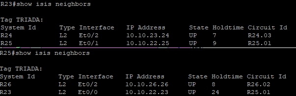

### Лабораторная работа 07 - IS-IS

Цель:<br/>

Настроить IS-IS офисе Триада

Описание:<br/>

1. Настроите IS-IS в ISP Триада.
2. R23 и R25 находятся в зоне 2222.
3. R24 находится в зоне 24.
4. R26 находится в зоне 26.


#### IS-IS в ISP Триада:

|Роутер|Зона|NET(Area ID + System-ID+ NSEL)|
|:-------:|:--------:|:----------:|
|R23|2222|49.0000.2222.0024.00|
|R24|24|49.0000.0000.0024.00|
|R25|2222|49.0000.2222.0025.00|
|R23|2222|49.0000.0000.0026.00|

#### Настройка IS-IS на каждом маршрутизаторе:

R23 - зона 2222

```
conf t
router isis TRIADA
net 49.0000.2222.0024.00
is-type level-2
exit

interface loopback 0 
 ip router isis TRIADA
exit

interface e0/1
ip router isis TRIADA
exit

interface e0/2
ip router isis TRIADA

```

R24 - зона 24 

```
conf t
router isis TRIADA
net 49.0000.0000.0024.00
is-type level-2
exit

interface loopback 0 
 ip router isis TRIADA
exit

interface e0/1
 ip router isis TRIADA
exit

interface e0/2
 ip router isis TRIADA
exit
```

R25 - зона 2222
```
conf t
router isis TRIADA
net 49.0000.2222.0025.00
is-type level-2
exit

interface loopback 0 
 ip router isis TRIADA
exit

interface e0/0
 ip router isis TRIADA
exit

interface e0/2
 ip router isis TRIADA
exit

```
R26 - зона 26

```
conf t
router isis TRIADA
net 49.0000.0000.0026.00
is-type level-2

interface loopback 0 
 ip router isis TRIADA
exit

interface e0/0
 ip router isis TRIADA
exit

interface e0/2
 ip router isis TRIADA
exit
```

Проверка соседства R23-R25



R24-R26

