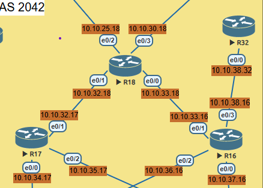
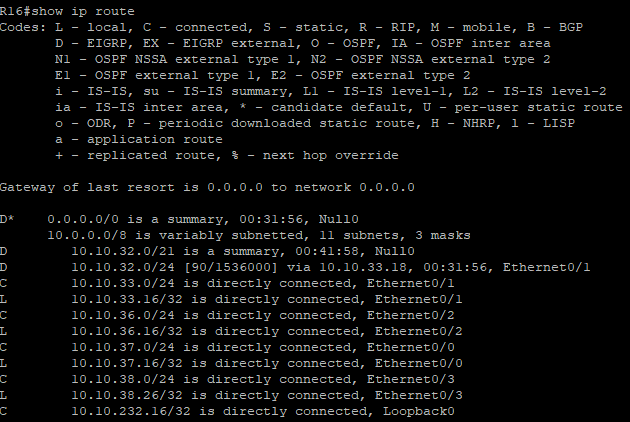
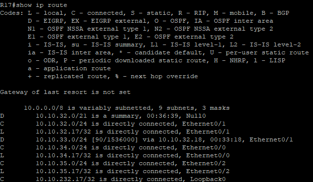
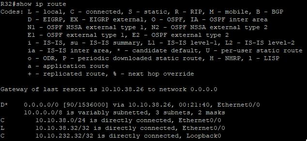

# Лабораторная работа 08 - EIGRP

Цель:<br/>
Настроить EIGRP в С.-Петербург;<br/>
Использовать named EIGRP

Описание:

1.В офисе С.-Петербург настроить EIGRP.<br/>
2.R32 получает только маршрут по умолчанию.<br/>
3.R16-17 анонсируют только суммарные префиксы.<br/>
4.Использовать EIGRP named-mode для настройки сети.

Топология:




Настройка EIGRP :

- R16

```
conf t
router eigrp SPB
address-family ipv4 unicast autonomous-system 2042
network 10.10.37.0 0.0.0.255
network 10.10.36.0 0.0.0.255
network 10.10.33.0 0.0.0.255
network 10.10.38.0 0.0.0.255
eigrp router-id 10.10.232.16

af-interface e0/0
passive-interface
af-interface e0/2
passive-interface
af-interface e0/0
summary-address 10.10.32.0 255.255.248.0
af-interface e0/3
summary-address 0.0.0.0 0.0.0.0
```

R17

```
conf t
router eigrp SPB
address-family ipv4 unicast autonomous-system 2042
network 10.10.32.0 0.0.0.255
  network 10.10.34.0 0.0.0.255
  network 10.10.35.0 0.0.0.255
  eigrp router-id 10.10.232.17

af-interface Ethernet0/0
   passive-interface
  exit-af-interface
 af-interface Ethernet0/2
   passive-interface
  exit-af-interface
 af-interface Ethernet0/1
   summary-address 10.10.32.0 255.255.248.0
  exit-af-interface

```

R18 

```
conf t
router eigrp SPB
address-family ipv4 unicast autonomous-system 2042
network 10.10.32.0 0.0.0.255
  network 10.10.33.0 0.0.0.255
  eigrp router-id 10.10.232.18
```

R32
```
router eigrp SPB
 address-family ipv4 unicast autonomous-system 2042
network 10.10.38.0 0.0.0.255
  eigrp router-id 10.10.232.32
```

### Проверка:

- R16

- R17

- R32

