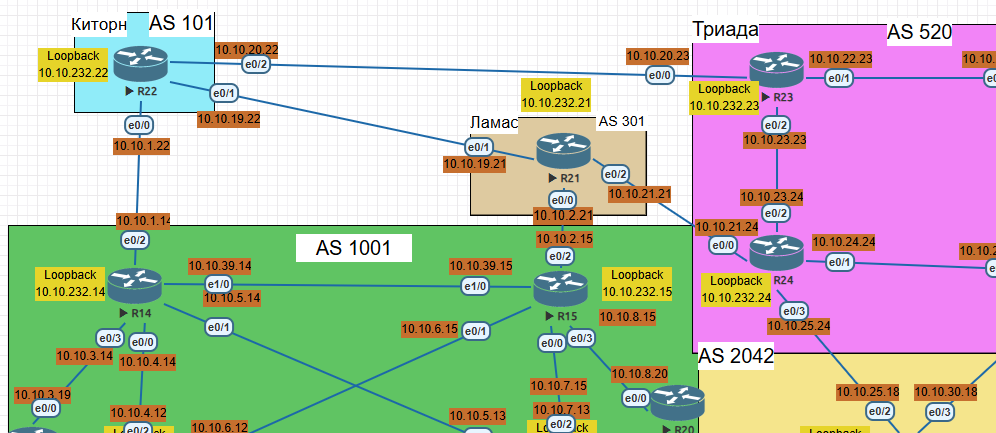
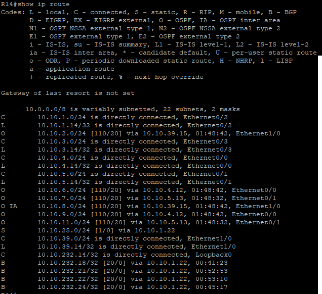
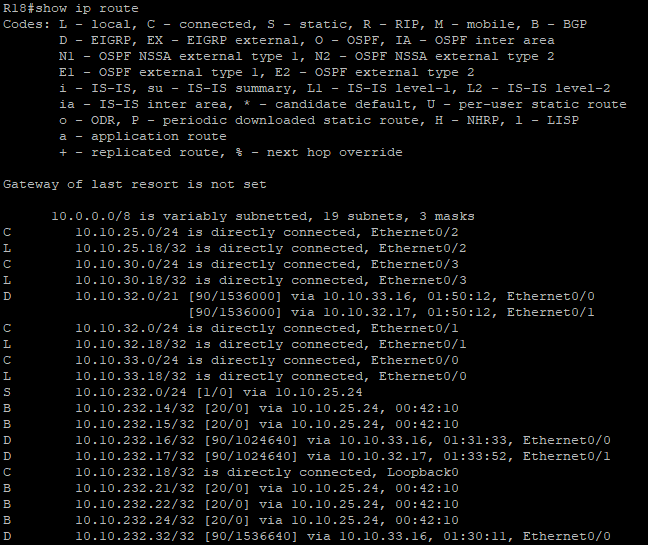

# Лабораторная работа 09. BGP. Основы

Цель:<br/>
Настроить BGP между автономными системами
Организовать доступность между офисами Москва и С.-Петербург

1. Настроите eBGP между офисом Москва и двумя провайдерами - Киторн и Ламас.
2. Настроите eBGP между провайдерами Киторн и Ламас.
3. Настроите eBGP между Ламас и Триада.
4. Настроите eBGP между офисом С.-Петербург и провайдером Триада.
5. Организуете IP доступность между пограничным роутерами офисами Москва и С.-Петербург.


Топология:



### Настроите eBGP между офисом Москва и двумя провайдерами - Киторн и Ламас.


R14 

```
conf t
router bgp 1001
bgp router-id 10.10.232.14
bgp log-neighbor-changes
network 10.10.232.14 mask 255.255.255.255
neighbor 10.10.1.22 remote-as 301
```

R15

```
conf t
router bgp 1001
bgp router-id 10.10.232.15
bgp log-neighbor-changes
network 10.10.232.15 mask 255.255.255.255
neighbor 10.10.2.21 remote-as 101

```
2. Настроите eBGP между провайдерами Киторн и Ламас.

R22
```
conf t
router bgp 101
bgp router-id 10.10.232.22
bgp log-neighbor-changes
network 10.10.232.22 mask 255.255.255.255
neighbor 10.10.1.14 remote-as 1001
neighbor 10.10.19.21 remote-as 301
```

R21
```
conf t
router bgp 301
bgp router-id 10.10.232.21
bgp log-neighbor-changes
network 10.10.232.21 mask 255.255.255.255
neighbor 10.10.19.22 remote-as 101
neighbor 10.10.2.15 remote-as 1001
neighbor 10.10.21.24 remote-as 520
```

### 3. Настроите eBGP между Ламас и Триада.

R24

```
conf t
router bgp 520
bgp router-id 10.10.232.24
bgp log-neighbor-changes
network 10.10.232.24 mask 255.255.255.255
neighbor 10.10.21.21 remote-as 301
neighbor 10.10.25.18 remote-as 2042
```

### 4. Настроите eBGP между офисом С.-Петербург и провайдером Триада.

R18
```
conf t
router bgp 2042
bgp router-id 10.10.232.18
bgp log-neighbor-changes
network 10.10.232.18 mask 255.255.255.255
neighbor 10.10.25.24 remote-as 520
```

### 5. Организуете IP доступность между пограничным роутерами офисами Москва R14 и С.-Петербург R18.

 Ping R14-R18<br/>


R14



R18


