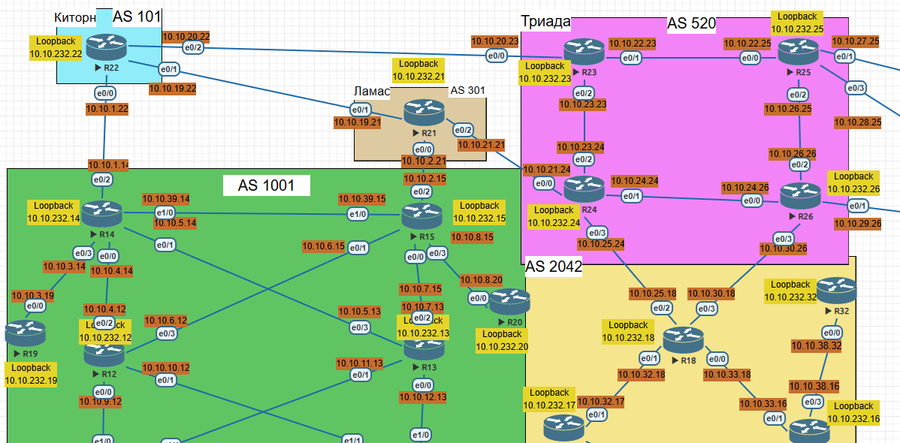
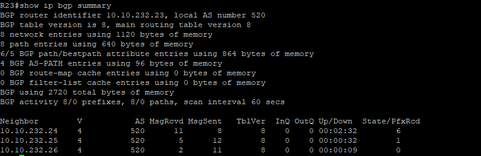

 # Лабораторная работа 10. iBGP

 Цель:<br/>
Настроить iBGP в офисе Москва<br/>
Настроить iBGP в сети провайдера Триада<br/>
Организовать полную IP связанность всех сетей<br/>


1. Настроите iBGP в офисом Москва между маршрутизаторами R14 и R15.<br/>
2. Настроите iBGP в провайдере Триада, с использованием RR.<br/>
3. Настройте офиса Москва так, чтобы приоритетным провайдером стал Ламас.<br/>
4. Настройте офиса С.-Петербург так, чтобы трафик до любого офиса распределялся по двум линкам одновременно.<br/>
5. Все сети в лабораторной работе должны иметь IP связность.<br/>

Топология:




### 1. Настроите iBGP в офисом Москва между маршрутизаторами R14 и R15.

R14
```
conf t
router  bgp 1001
bgp log-neighbor-changes
bgp router-id 10.10.232.14
neighbor 10.10.232.15 remote-as 1001
neighbor 10.10.232.15 update-source loopback 0
neighbor 10.10.232.15 description iBGP-TO-R15
network 10.10.232.14 mask 255.255.255.255
no auto-summary
end
```

R15
```
router bgp 1001
bgp log-neighbor-changes
bgp router-id 10.10.232.115
neighbor 10.10.232.14 remote-as 1001
neighbor 10.10.232.14 update-source loopback 0
neighbor 10.10.232.14 description iBGP-TO-R14
neighbor 10.10.232.14 next-hop-self
network 10.10.232.15 mask 255.255.255.255
no auto-summary
end
```

### 2. Настроите iBGP в провайдере Триада, с использованием RR.

- Route-Reflector (RR) - R23


R23

```
conf t
router bgp 520
bgp log-neighbor-changes
bgp router-id 10.10.232.23

neighbor 10.10.232.24 remote-as 520
neighbor 10.10.232.24 update-source Loopback0
neighbor 10.10.232.24 route-reflector-client

neighbor 10.10.232.25 remote-as 520
neighbor 10.10.232.25 update-source Loopback0
neighbor 10.10.232.25 route-reflector-client

neighbor 10.10.232.26 remote-as 520
neighbor 10.10.232.26 update-source Loopback0
neighbor 10.10.232.26 route-reflector-client\

network 10.10.232.23 mask 255.255.255.255
no auto-summary
end
```

R24
```
conf t
router bgp 520
bgp log-neighbor-changes
bgp router-id 10.10.232.24
neighbor 10.10.232.23 remote-as 520
neighbor 10.10.232.23 update-source Loopback0
neighbor 10.10.232.23 description RR-R23
network 10.10.232.24 mask 255.255.255.255
no auto-summary
end
```

R25
```
conf t
router bgp 520
bgp log-neighbor-changes
bgp router-id 10.10.232.25
neighbor 10.10.232.23 remote-as 520
neighbor 10.10.232.23 update-source Loopback0
neighbor 10.10.232.23 description RR-R23
network 10.10.232.25 mask 255.255.255.255
no auto-summary
end
```

R26
```
conf t
router bgp 520
bgp log-neighbor-changes
bgp router-id 10.10.232.26
neighbor 10.10.232.23 remote-as 520
neighbor 10.10.232.23 update-source Loopback0
neighbor 10.10.232.23 description RR-R23
network 10.10.232.26 mask 255.255.255.255
no auto-summary
end
```




### 3. Настройте офиса Москва так, чтобы приоритетным провайдером стал Ламас.

Сделаем route-map для соседнего R21 и изменим local-preference на значение > 100 будет предпочитать этот маршрут.

R15
```
```


