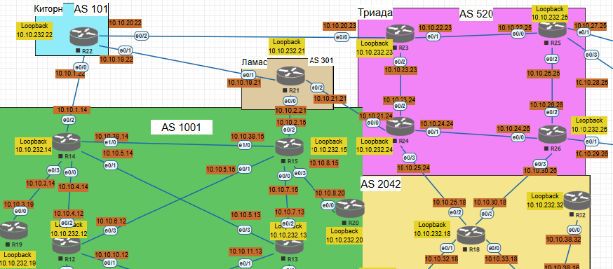
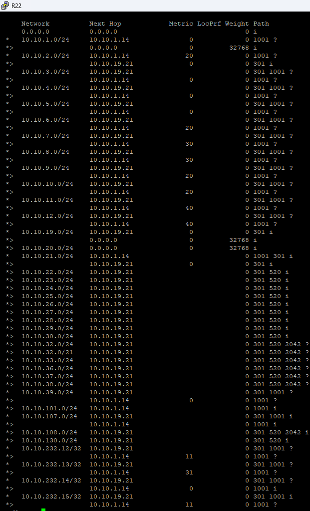
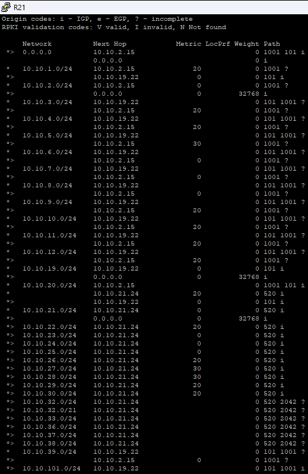
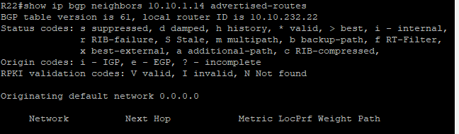
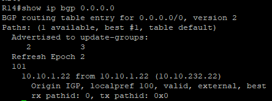
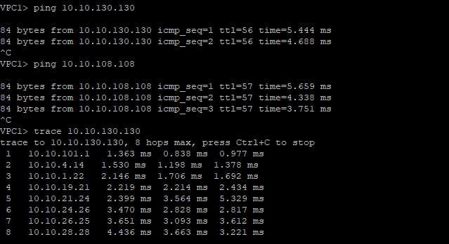

# 11 Лабораторная работа BGP. Фильтрация

Цель:<br/>

1. Настроить фильтрацию в офисе Москва так, чтобы не появилось транзитного трафика(As-path).<br/>
2. Настроить фильтрацию в офисе С.-Петербург так, чтобы не появилось транзитного трафика(Prefix-list).<br/>
3. Настроить провайдера Киторн так, чтобы в офис Москва отдавался только маршрут по умолчанию.<br/>
4. Настроить провайдера Ламас так, чтобы в офис Москва отдавался только маршрут по умолчанию и префикс офиса С.-Петербург.<br/>
5. Все сети в лабораторной работе должны иметь IP связность.<br/>

Топология:



### 1. Настроить фильтрацию в офисе Москва так, чтобы не появилось транзитного трафика(As-path).

R14:
```
conf t
ip as-path access-list 10 permit ^101$
router bgp 1001
address-family ipv4
neighbor 10.10.1.22 filter-list 10 in
exit-address-family


```

R15:
```
enable
configure terminal
ip as-path access-list 11 permit ^301$
router bgp 1001
address-family ipv4
neighbor 10.10.2.21 filter-list 11 in
exit-address-family

```
show ip bgp R22

R21


### 2. Настроить фильтрацию в офисе С.-Петербург так, чтобы не появилось транзитного трафика(Prefix-list)
Создадим списки префиксов C.-Петербург и применим фильтр:

R18

```
conf t
ip prefix-list AS520 seq 5 permit 0.0.0.0/0
ip prefix-list AS520 seq 10 permit 10.10.100.0/24
ip prefix-list AS520 seq 15 permit 10.10.108.0/24
ip prefix-list AS520 seq 20 permit 10.10.232.16/32
ip prefix-list AS520 seq 25 permit 10.10.232.17/32
ip prefix-list AS520 seq 30 permit 10.10.232.18/32
ip prefix-list AS520 seq 35 permit 10.10.232.32/32
ip prefix-list AS520 seq 100 deny 0.0.0.0/0 le 32 

router bgp 2042
address-family ipv4
neighbor 10.10.25.24 prefix-list AS520 in
exit-address-family

```
### 3. Настроить провайдера Киторн так, чтобы в офис Москва отдавался только маршрут по умолчанию.

Создадим префикс-лист, разрешающий только маршрут по умолчанию:

R22
```
conf t
ip prefix-list TO_MOSCOW seq 5 permit 0.0.0.0/0
ip prefix-list TO_MOSCOW seq 10 deny 0.0.0.0/0 le 32

router bgp 101
address-family ipv4
neighbor 10.10.1.14 prefix-list TO_MOSCOW
end
```




### 4. Настроить провайдера Ламас так, чтобы в офис Москва отдавался только маршрут по умолчанию и префикс офиса С.-Петербург.

R21:
```
conf t
ip prefix-list TO_MOSCOW seq 5 permit 0.0.0.0/0
ip prefix-list TO_MOSCOW seq 10 permit 10.10.100.0/24
ip prefix-list TO_MOSCOW seq 15 permit 10.10.108.0/24
ip prefix-list TO_MOSCOW seq 20 permit 10.10.232.16/32
ip prefix-list TO_MOSCOW seq 25 permit 10.10.232.17/32
ip prefix-list TO_MOSCOW seq 30 permit 10.10.232.18/32
ip prefix-list TO_MOSCOW seq 35 permit 10.10.232.32/32
ip prefix-list TO_MOSCOW seq 100 deny 0.0.0.0/0 le 32

router bgp 301
address-family ipv4
neighbor 10.10.2.15 prefix-list TO_MOSCOW out
end
```

### 5. Все сети в лабораторной работе должны иметь IP связность




