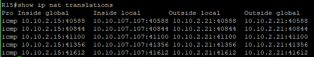

# Лабораторная работа - Основные протоколы сети интернет.

- Цель:

1. Настроите NAT(PAT) на R14 и R15. Трансляция должна осуществляться в адрес автономной системы AS1001.<br/>
2. Настроите NAT(PAT) на R18. Трансляция должна осуществляться в пул из 5 адресов автономной системы AS2042.<br/>
3. Настроите статический NAT для R20.<br/>
4. Настроите NAT так, чтобы R19 был доступен с любого узла для удаленного управления.<br/>
5. Настроите статический NAT(PAT) для офиса Чокурдах.
Настроите для IPv4 DHCP сервер в офисе Москва на маршрутизаторах R12 и R13. VPC1 и VPC7 должны получать сетевые настройки по DHCP.<br/>
6. Настроите NTP сервер на R12 и R13. Все устройства в офисе Москва должны синхронизировать время с R12 и R13.<br/>

### Топология


### 1. Настроите NAT(PAT) на R14 и R15 (AS1001)

R14

```
conf t

access-list 101 permit ip 10.10.0.0 0.0.255.255 any

interface ethernet0/2
ip nat outside

interface ethernet0/3
ip nat inside

interface ethernet0/0
ip nat inside

interface ethernet0/1
ip nat inside

ip nat inside source list 101 interface ethernet0/2 overload
```

R15

```
conf t

access-list 101 permit ip 10.10.0.0 0.0.255.255 any
interface ethernet0/2

interface ethernet0/2
ip nat outside

interface ethernet0/1
ip nat inside

interface ethernet0/0
ip nat inside

interface ethernet0/3
ip nat inside

ip nat inside source list 101 interface ethernet0/overload

```




### 2. Настроите NAT(PAT) на R18. Трансляция должна осуществляться в пул из 5 адресов автономной системы AS2042


R18

```
Conf t

access-list 102 permit ip 10.10.32.0 0.0.3.255 any
access-list 102 permit ip 10.10.36.0 0.0.1.255 any
access-list 102 permit ip 10.10.108.0 0.0.0.255 any
access-list 102 permit ip 10.10.100.0 0.0.0.255 any

ip nat pool AS2042_POOL 10.10.25.100 10.10.25.104 netmask 255.255.255.0

interface ethernet0/2
ip nat outside

interface ethernet0/3
ip nat outside

interface ethernet0/0
ip nat inside

interface ethernet0/1
ip nat inside

ip nat inside source list 102 pool AS2042_POOL overload

```


### 3. Настроите статический NAT для R20

R15

```
conf t

ip nat inside source static 10.10.8.20 10.10.2.100

```


### 4. Настроите NAT так, чтобы R19 был доступен с любого узла для удаленного управления


R14 
```
conf t

ip nat inside source static tcp 10.10.3.19 22 interface ethernet0/2 2222

```


### 5. Настроите статический NAT(PAT) для офиса Чокурдах. Настроите для IPv4 DHCP сервер в офисе Москва на маршрутизаторах R12 и R13. VPC1 и VPC7 должны получать сетевые настройки по DHCP.


R28

```
conf t

ip access-list extended CHOKURDAH_NAT
permit ip 10.10.130.0 0.0.0.255 any
permit ip 10.10.131.0 0.0.0.255 any

interface ethernet0/0
ip nat outside

interface ethernet0/1
ip nat outside

interface ethernet0/2.130
ip nat inside

interface ethernet0/2.131
ip nat inside

ip nat inside source list CHOKURDAH_NAT interface ethernet0/0 overload

```


R12

```
conf t
ip dhcp pool VPC1
network 10.10.101.0 255.255.255.0
default-router 10.10.101.1
domain-name MOSCOW
exit
ip dhcp excluded-address 10.10.101.1

```
R13
```
conf t
ip dhcp pool VPC7
network 10.10.107.0 255.255.255.0
default-router 10.10.107.1
domain-name MOSCOW
exit
ip dhcp excluded-address 10.10.107.1
```


### 6. Настроите NTP сервер на R12 и R13. Все устройства в офисе Москва должны синхронизировать время с R12 и R13

R12-R13
```
conf t
ntp master 5
ip access-list standard 10
permit 10.10.0.0 0.0.255.255
exit
ntp access-group peer 10
```


