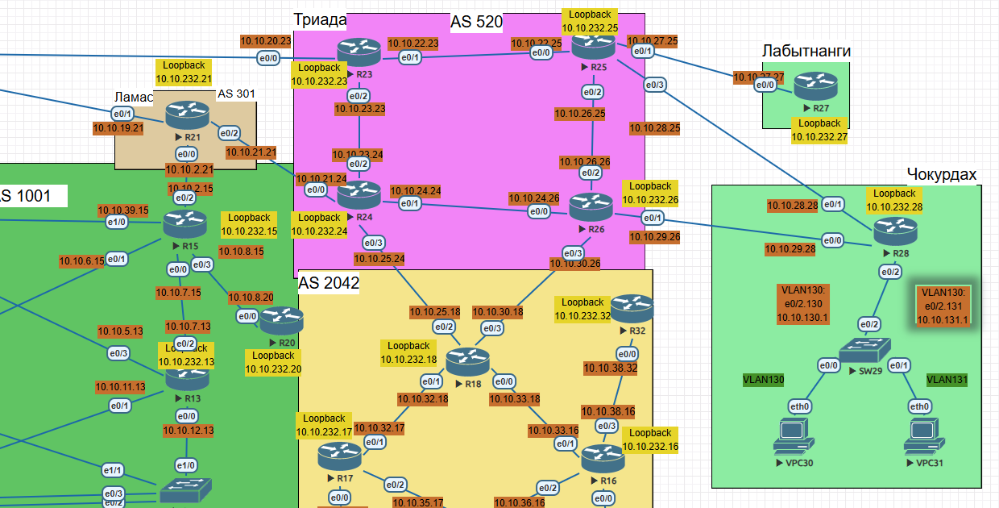
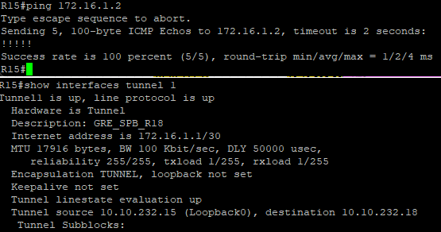
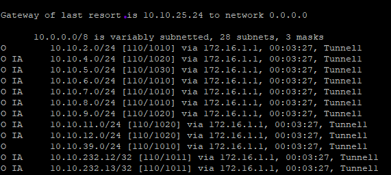
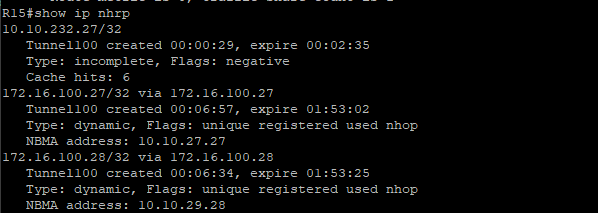
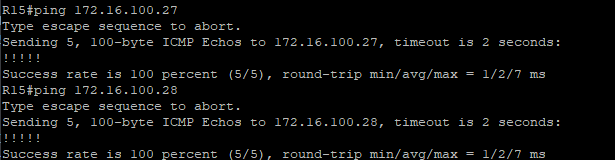
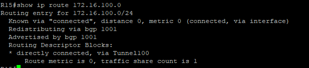
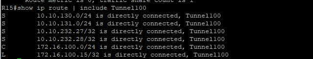
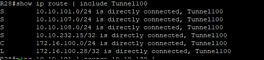

# 13 Лабраторная работа - VPN. GRE. DmVPN

Цель:

1. Настроите GRE между офисами Москва и С.-Петербург.
2. Настроите DMVMN между Москва и Чокурдах, Лабытнанги.

Топология:




### 1. Настроите GRE между офисами Москва и С.-Петербург.

R15
```
conf t
interface tunnel 1
description GRE_SPB_R18
ip address 172.16.1.1 255.255.255.252
ip ospf 1 area 0
tunnel source Loopback0
tunnel destination 10.10.232.18
exit

ip route 10.10.232.18 255.255.255.255 10.10.1.22
```

R18
```
conf t
interface Tunnel1
description GRE_MOSCOW_R15
ip address 172.16.1.2 255.255.255.252
ip ospf 1 area 0
tunnel source Loopback0
tunnel destination 10.10.232.15
exit

ip route 10.10.232.15 255.255.255.255 10.10.25.24
```


R18


### 2. Настроите DMVMN между Москва и Чокурдах, Лабытнанги.

DMVPN между R14, R27, R28:

Подсеть тунеля 172.16.100.0/24

R15 (HUB)

```
conf t
interface Tunnel100
description DMVPN_HUB_CHOKURDAH_LABYTNANGi
ip address 172.16.100.15 255.255.255.0
no ip redirects
ip mtu 1400
tunnel mode gre multipoint
tunnel source Ethernet0/2
ip tcp adjust-mss 1360
ip nhrp network-id 100
ip nhrp authentication cisco123
ip nhrp map multicast dynamic

```

R27 (Spoke)

```
conf t
interface tunnel100
no ip redirects
tunnel mode gre multipoint
description DMVPN_to_Moscow_HUB
ip address 172.16.100.27 255.255.255.0
tunnel source Ethernet0/0
ip mtu 1400
ip tcp adjust-mss 1360
ip nhrp network-id 100
ip nhrp authentication cisco123
ip nhrp map multicast 10.10.2.15
ip nhrp nhs 172.16.100.15
ip nhrp map 172.16.100.15 10.10.2.15
```
R28 (Spoke)

```
conf t
interface tunnel100
no ip redirects
tunnel mode gre multipoint
description DMVPN_to_Moscow_HUB
ip address 172.16.100.28 255.255.255.0
tunnel source Ethernet0/0
ip mtu 1400
ip tcp adjust-mss 1360
ip nhrp network-id 100
ip nhrp authentication cisco123
ip nhrp map multicast 10.10.2.15
ip nhrp nhs 172.16.100.15
ip nhrp map 172.16.100.15 10.10.2.15

```
Проверка:










