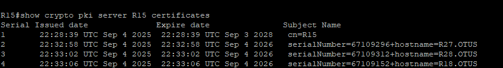
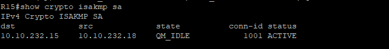
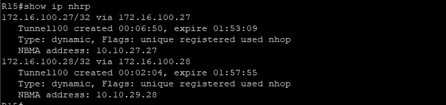
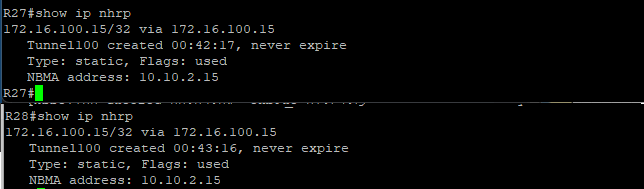
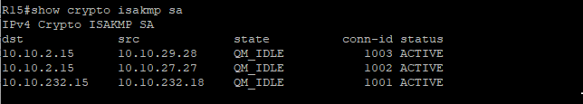
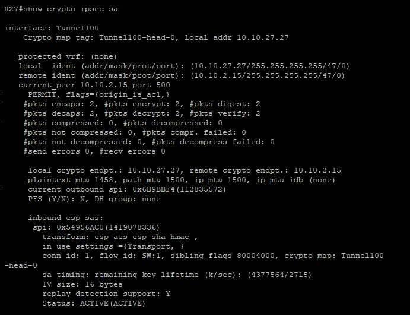
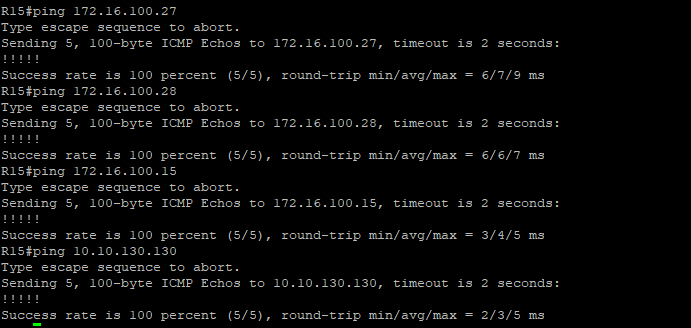
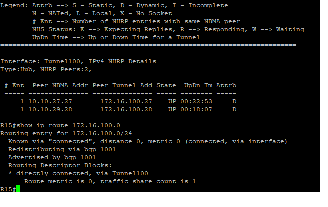

# 14. Лабораторная работа - IPSec over DmVPN

Цель:

Настроить GRE поверх IPSec между офисами Москва и С.-Петербург

Настроить DMVPN поверх IPSec между офисами Москва и Чокурдах, Лабытнанги


### 1.  Для IPSec использовать CA и сертификаты.
-  настроим СА и выдадим сертификаты.
Настройка СA и выдача сертефикатов
R15
```
conf t
ip http server
ip domain name OTUS
crypto key generate rsa general-keys label R15 modulus 2048 exportable
crypto pki server R15
database level complete
no shutdown 
(Password: cisco123)


```
R14-R27-R28-R18

```
ip domain name OTUS
ip host R15 10.10.232.15
crypto key generate rsa
exit
crypto pki trustpoint R15
enrollment url http://R15:80
crypto pki authenticate R15
crypto pki enroll R15
```
на R15 подписываем запросы на сертефикаты:

```
crypto pki server R15 grant 1
crypto pki server R15 grant 2
crypto pki server R15 grant 3

```




- ##### Настройка IKE-политики IPSec
R15-R18
```
conf t
crypto isakmp enable
crypto isakmp policy 10
encr aes
hash sha256
group 16
lifetime 3600
exit
crypto ipsec transform-set VTI esp-aes esp-sha-hmac
mode transport
crypto ipsec profile MOSCOW
set transform-set VTI
```
R15-R27-R28
```
crypto isakmp enable
crypto isakmp policy 15
encr aes
hash sha256
group 16
lifetime 3600
exit
crypto isakmp key cisco123 address 10.10.2.15
crypto ipsec transform-set VTI esp-aes esp-sha-hmac
mode transport
crypto ipsec profile MOSCOW-1
set transform-set VTI
```

- ####  Добавить политики к тунелям:
R15-R18

```
conf t
interface tunnel1
tunnel protection ipsec profile MOSCOW
```
R15-R27-R28
```
conf t
interface tunnel100
tunnel protection ipsec profile MOSCOW-1
```
- ###  Проверка:













